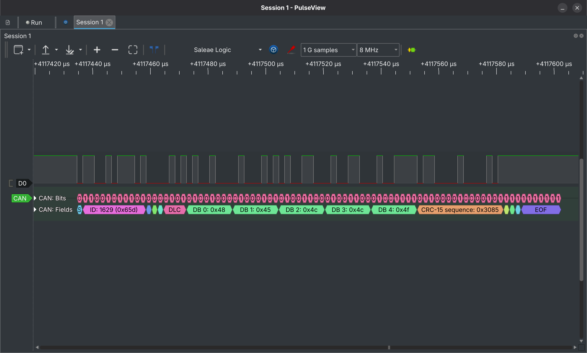
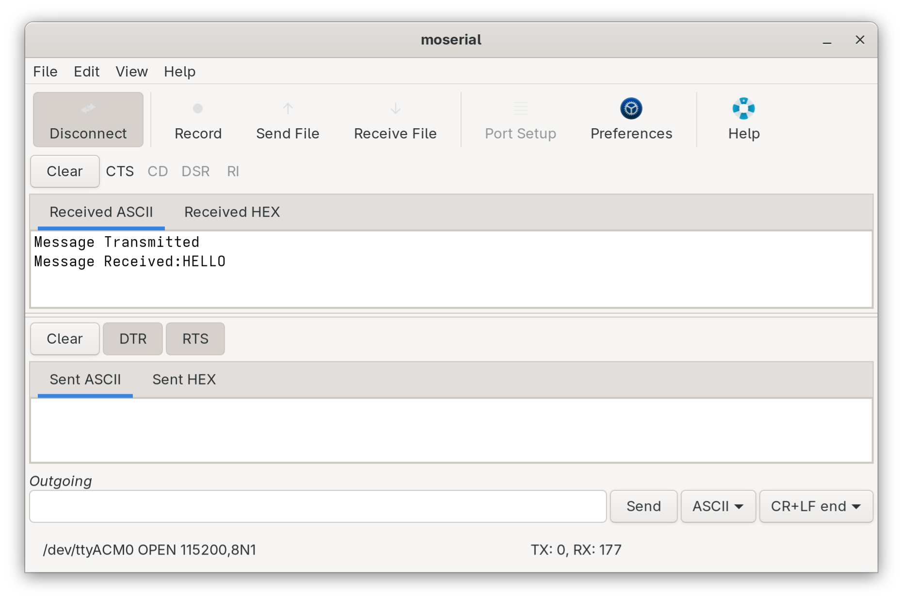
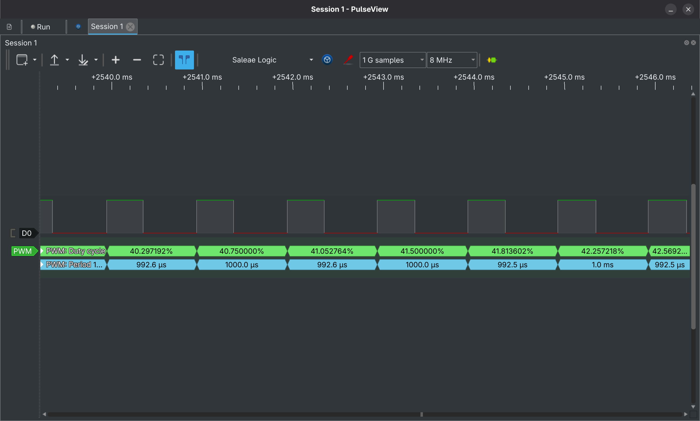
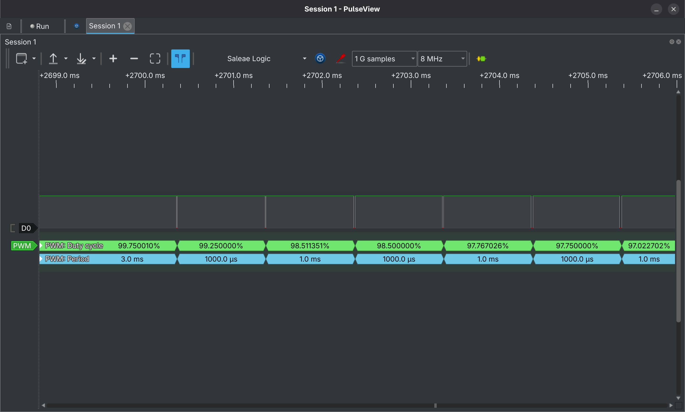
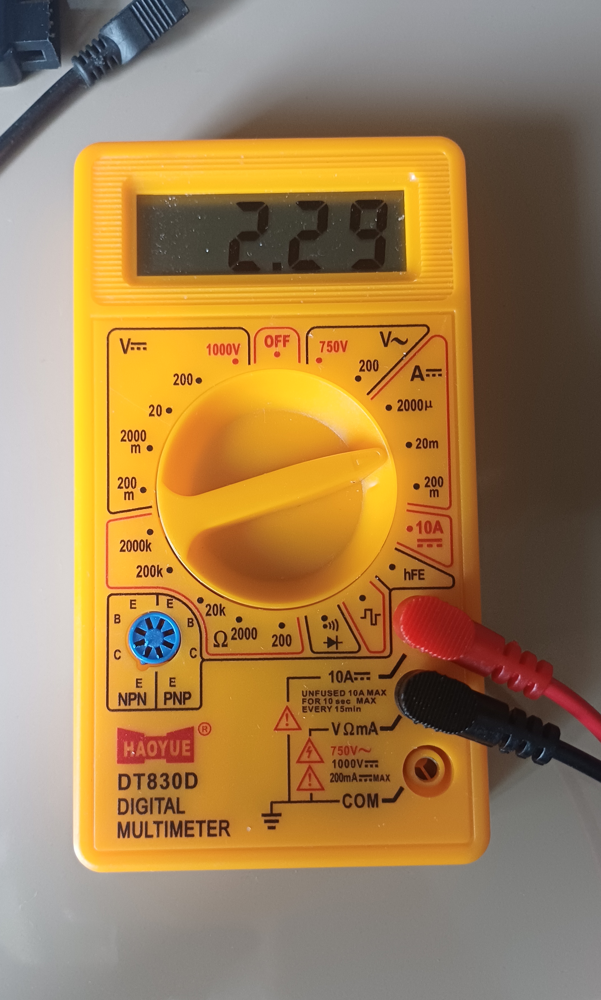
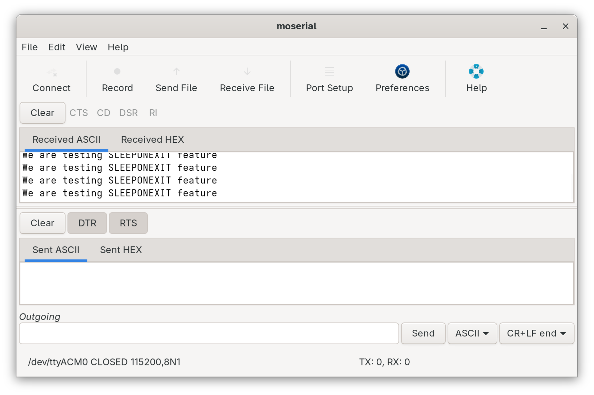

Hand-written peripheral configurations for STM32F446RE 
using STM32 HAL drivers. No CubeMX code generation is used for 
MSP callbacks, interrupt handlers and peripheral inits, 
all are written manually.

## Hardware
- STM32 Nucleo F446RE
- Logic analyzer (Saleae) for signal verification
- TJA1050 CAN transceiver for CAN examples

## Contents

### UART
| Projects | Description |
|---------|-------------|
| 001_UART2_Example | UART2 TX/RX in polling mode |
| 002_UART2_Example_IT | UART2 TX/RX in interrupt mode with callback |

### Clock_Config
| Projects | Description |
|---------|-------------|
| 003_HSE_SYSCLK_8Mhz | HSE crystal as system clock at 8MHz |
| 004_PLL_SYSCLK | PLL configured from HSI |
| 005_PLL_SYSCLK_HSE | PLL configured from HSE for stable clock |

### Timers-PWM
| Projects | Description |
|---------|-------------|
| 006_Time_base_100ms | TIM6 basic timebase 100ms polling |
| 007_Time_base_100ms_IT | TIM6 timebase 100ms interrupt mode |
| 008_Time_base_10ms | TIM6 timebase 10ms precision |
| 009_timer_IC_1 | Input capture to measure external signal frequency |
| 010_timerOC_1 | Output compare used for precise timing event generation |
| 011_timerOC_PWM | PWM generation using output compare mode |
| 012_timerPWM_LED | PWM LED brightness control |

### CAN
| Projects | Description |
|---------|-------------|
| 013_CAN_LoopBack | CAN1 loopback test where TX frame received back and verified |
| 014_CAN_LoopBack_IT | CAN1 loopback test in interrupt mode |

## Key Implementation Notes
- HSE requires `RCC_HSE_BYPASS` on Nucleo (it uses ST-LINK clock)
- SysTick fix was applied before `HAL_RCC_ClockConfig` 
  in every HSE project
- MSP init functions handle GPIO alternate function config (low level programming)

## Verification

### CAN Loopback - PulseView Capture

#### CAN Loopback - Moserial Output 

### PWM Output - PulseView Capture
- PWM duty cycle sweeps from 0% to 100% continuously and the period remains constant at 1.0ms and 1kHz frequency is also maintained.
#### PWM Output - Rising

#### PWM Output - Falling

### Low power mode (Sleep ON exit) - Multimeter Output
#### Processor current consumption after Sleep ON exit enabled 
#### Active mode: ~3.45mA → Sleep mode: ~2.29mA

### Moserial output confirms UART print on each wake cycle 
#### Verifying interrupt handler executed correctly.

