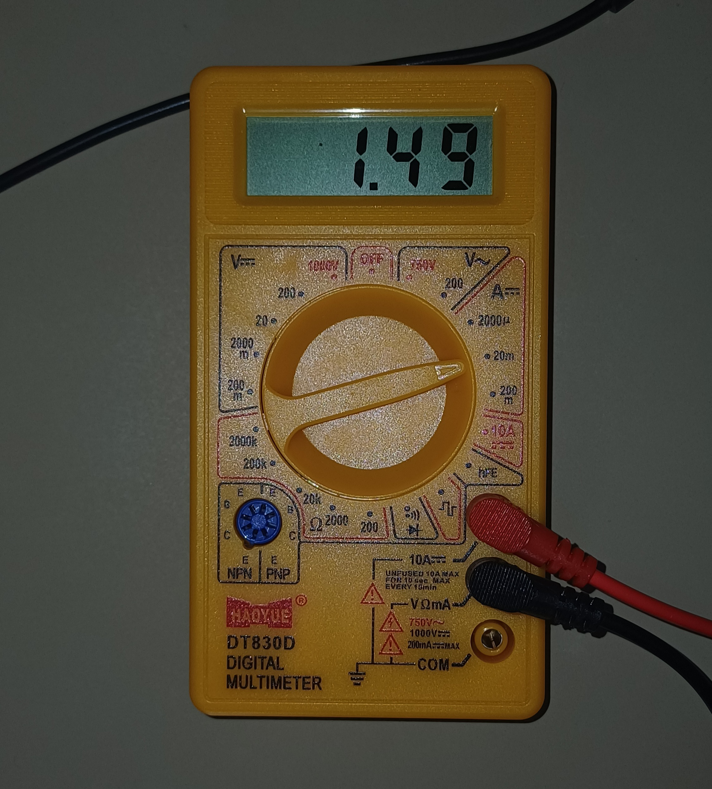

# STM32F446RE HAL Peripheral Examples

Hand-written peripheral configurations for STM32F446RE using STM32 HAL drivers.
No CubeMX code generation used for MSP callbacks, interrupt handlers or peripheral inits.
All written manually.
(Scroll all the way to see verification screenshots)

## Hardware
- STM32 Nucleo F446RE
- Logic analyzer (Saleae clone) for signal verification
- TJA1050 CAN transceiver for CAN examples

## Contents

### UART
| Project | Description |
|---------|-------------|
| 001_UART2_Example | UART2 TX/RX polling mode |
| 002_UART2_Example_IT | UART2 TX/RX interrupt mode with callback |

### Clock Configuration
| Project | Description |
|---------|-------------|
| 003_HSE_SYSCLK_8Mhz | HSE crystal as system clock at 8MHz |
| 004_PLL_SYSCLK | PLL configured from HSI |
| 005_PLL_SYSCLK_HSE | PLL configured from HSE for stable clock |

### Timers and PWM
| Project | Description |
|---------|-------------|
| 006_Time_base_100ms | TIM6 basic timebase 100ms polling |
| 007_Time_base_100ms_IT | TIM6 timebase 100ms interrupt mode |
| 008_Time_base_10ms | TIM6 timebase 10ms precision |
| 009_timer_IC_1 | Input capture to measure external signal frequency |
| 010_timerOC_1 | Output compare for precise timing event generation |
| 011_timerOC_PWM | PWM generation using output compare mode |
| 012_timerPWM_LED | PWM LED brightness control |

### CAN
| Project | Description |
|---------|-------------|
| 013_CAN_LoopBack | CAN1 loopback test, TX frame received back and verified |
| 014_CAN_LoopBack_IT | CAN1 loopback in interrupt mode |

### Low Power
| Project | Description |
|---------|-------------|
| 015_SleepON_Exit | Sleep ON exit mode, wakes on every interrupt |
| 016_WFI_Button | WFI sleep, wakes on button press via EXTI |
| 017_WFE_Button | WFE sleep, wakes on button press event |
| 018_BackUpSRAM_Standby | Backup SRAM retention through standby mode |

### RTC
| Project | Description |
|---------|-------------|
| 019_RTC_Date_Time | RTC calendar, time and date display over UART |
| 020_RTC_AlarmA | RTC alarm A triggering at configured time |

## Key Implementation Notes
- HSE requires `RCC_HSE_BYPASS` on Nucleo as it uses ST-LINK clock
- SysTick fix applied before `HAL_RCC_ClockConfig` in every HSE project
- MSP init functions handle GPIO alternate function config at register level

## Verification

### CAN Loopback
CAN1 loopback frame decoded on logic analyzer showing ID, DLC, data bytes and CRC-15.

### PWM Output
PWM duty cycle sweeps 0% to 100% continuously. Period constant at 1.0ms, frequency maintained at 1kHz.

| Sweep | Capture |
|-------|---------|
| Rising |  |
| Falling |  |

### Low Power Mode
Current measured via JP6 IDD jumper on Nucleo F446RE.

| Mode | Current |
|------|---------|
| Active | ~3.00mA |
| Sleep ON exit | ~2.29mA |
| No WFI | ~11.00mA |
| WFI | ~1.50mA |

